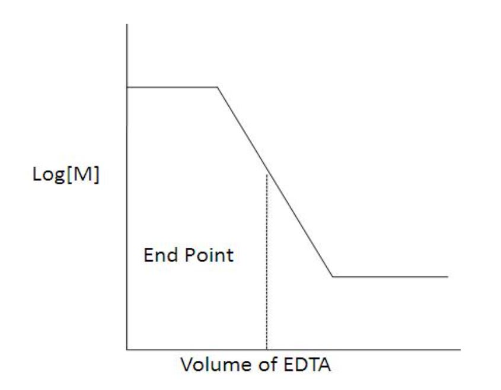
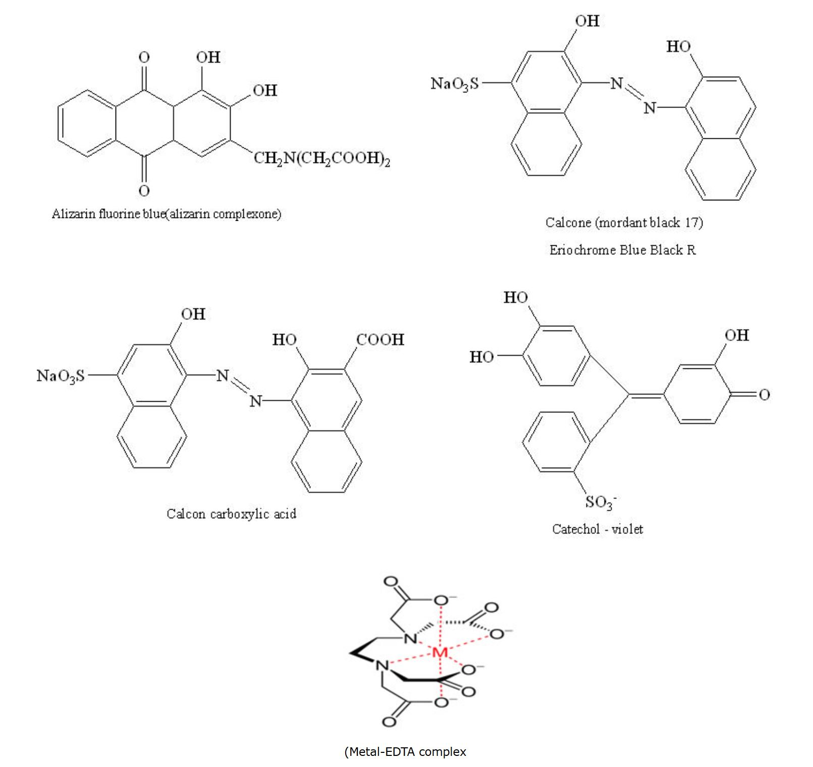

### Theory 

<section>
  <h2>Titration</h2>
  
The word titration comes from the Latin word "titulus", which means inscription or title. The French word title means rank. Therefore, Titration means the determination of concentration or rank of a solution with respect to water with a pH of 7.

  
The standard solution is usually added from a graduated vessel called a burette. The process of adding standard solution until the reaction is just complete is termed as titration and the substance to be determined is said to be titrated.

  
All chemical reactions cannot be considered as titrations. A reaction can serve as a basis of a titration procedure only if the following conditions are satisfied:

  <ul>
    <li>The reaction must be a fast one.</li>
    <li>It must proceed stoichiometrically.</li>
    <li>The change in free energy (ΔG) during the reaction must be sufficiently large for spontaneity of the reaction.</li>
    <li>There should be a way to detect the completion of the reaction.</li>
  </ul>
</section>

<section>
  <h2>End point and Equivalent point</h2>
  
For a reaction, a stage which shows the completion of a particular reaction is known as end point. Equivalence point is a stage in which the amount of reagent added is exactly and stoichiometrically equivalent to the amount of the reacting substance in the titrated solution.

  
The end point is detected by some physical change produced by the solution, by itself or more usually by the addition of an auxiliary reagent known as an 'indicator'. The end point and the equivalence point may not be identical. End point is usually detected only after adding a slight excess of the titrant. In many cases, the difference between these two will fall within the experimental error.

</section>

<section>
  <h2>Indicator</h2>
  
It is a chemical reagent used to recognize the attainment of end point in a titration. After the reaction between the substance and the standard solution is complete, the indicator should give a clear colour change.

  
When a titration is carried out, the free energy change for the reaction is always negative. That is, during the initial stages of the reaction between A & B, when the titrant A is added to B the following reaction takes place.

</section>

$$A + B \rightleftharpoons C + D$$

Equilibrium constant,

$$K = \frac{a_C \cdot a_D}{a_A \cdot a_B} = \frac{[C] \cdot [D]}{[A] \cdot [B]}$$

a = activity co-efficient.

 

Large values of the equilibrium constant K implies that the equilibrium concentration of A & B are very small at the equivalence point. It also indicates that the reverse reaction is negligible and the product C & D are very much more stable than the reactants A & B. Greater the value of K the larger the magnitude of the negative free energy change for the reaction between A & B. Since,

$$\text{Free Energy Change}=\Delta G=-RT\ln K$$

<section>
  
<strong>Where,</strong>

  
<strong>R</strong> = Universal gas Constant = 8.314 JK-1mol-1, 
     <strong>T</strong> = Absolute Temperature.

  
The reaction of the concentration of A &amp; B leads to the reduction of the total free energy change. If the concentrations of A &amp; B are too low, the magnitude of the total free energy change becomes so small and the use of the reaction for titration will not be feasible.

</section>

<section>
  <h2>Expressions of Concentration of Solutions</h2>
  
The concentration or strength of solution means the amount of solute present in a given amount of the solution. The concentration may be expressed in physical or chemical units.

</section>

$$\text{Normality}=\frac{W\times 1000}{E \times V}$$

<b>Normality (N):</b> It is defined as number of gram equivalents of the solute present in 1 litre (1000mL) of the solution. If W g of solute of equivalent weight E is present in V mL of the solution, the normality of the solution is given by:

<b>Molarity (M):</b> It is defined as the number of moles of the solute present in 1 litre (or 1000 mL) of the solution. A one molar solution contains 1 mole of the solute dissolved in 1 litre of the solution.

<b>Molality (m):</b> It is defined as the number of moles of solute dissolved in 1000 g of the solvent. One molal solution contains one mole of the solute dissolved in 1000 g of the solvent.

<b>Normal solution:</b> 
A solution containing one gram equivalent weight of the solute dissolved per litre is called a normal solution; e.g. when 40 g of NaOH are present in one litre of NaOH solution, the solution is known as normal (N) solution of NaOH. Similarly, a solution containing a fraction of gram equivalent weight of the solute dissolved per litre is known as subnormal solution. For example, a solution of NaOH containing 20 g (1/2 of g eq. wt.) of NaOH dissolved per litre is a sub-normal solution. It is written as N/2 or 0.5 N solution.

<b>Formulae used in solving numerical problems on volumetric analysis:</b>

<ul>
  <li>Strength of solution = Amount of substance in g litre-1.</li>
  <li>Strength of solution = Amount of substance in g moles litre-1.</li>
  <li>Strength of solution = Normality × Eq. wt. of the solute = molarity × Mol. wt. of solute.</li>
  <li>Molarity = Moles of solute / Volume in litre.</li>
  <li>Number of moles = Wt. in g / Mol. wt = M × V (initial) = Volume in litres / 22.4 at NTP (only for gases).</li>
  <li>Number of millimoles = Wt. in g × 1000 / Mol. wt. = Molarity × Volume in mL.</li>
  <li>Number of equivalents = Wt. in g / Eq. wt = x × No. of moles = Normality × Volume in litre (Where x = Mol. wt / Eq. wt).</li>
  <li>Number of milliequivalents (meq.) = Wt. in g × 1000 / Eq. wt = Normality × Volume in mL.</li>
  <li>Normality = x × No. of millimoles (Where x = valency or change in oxidation number).</li>
  <li>Normality formula: N₁V₁ = N₂V₂ (Where N₁, N₂ → Normality of titrant and titrate respectively; V₁, V₂ → Volume of titrant and titrate respectively).</li>
  <li>% by weight = Wt. of solute / Wt. of solution × 100</li>
</ul>

A solution is a homogeneous mixture of two or more components, the composition of which may be changed. The substance which is present in smaller proportion is called the solute, while the substance present in large proportion is called the solvent.

### Volumetric Analysis: 

It involves the estimation of a substance in solution by neutralization, precipitation, oxidation or reduction by means of another solution of accurately known strength. This solution is known as standard solution.

Volumetric analysis depends on measurements of the volumes of solutions of the interacting substances. A measured volume of the solution of a substance A is allowed to react completely with the solution of definite strength of another substance B. The volume of B is noted. Thus, we know the volume of the solutions A and B used in the reaction and the strength of solution B; so the strength of the other solution A is obtained. The amount (or concentration) of the dissolved substance in volumetric analysis is usually expressed in terms of normality.

The weight in grams of the substance per litre of the solution is related to normality of the solution as:

<b>Weight of the substance (g per litre) = Normality × gram equivalent weight of the substance.</b>

<b>Conditions of Volumetric Analysis:</b>

<ul>
  <li>i) The reaction between the titrant and titrate must be expressed.</li>
  <li>ii) The reaction should be practically instantaneous.</li>
  <li>iii) There must be a marked change in some physical or chemical property of the solution at the end point.</li>
  <li>iv) An indicator should be available which should sharply define the end point.</li>
</ul>

<b>Different methods to determine the endpoint include:</b>

<ul>
  <li>
    
<b>pH Indicator:</b> A pH indicator is a substance that changes its colour in response to a chemical change. An acid-base indicator changes its colour depending on the pH (e.g., phenolphthalein). Redox indicators are also frequently used. A drop of indicator solution is added to the titration at the start; at the endpoint, the colour changes.

  </li>

  <li>
    
<b>Potentiometric Method:</b> It is an instrument that measures the electrode potential of the solution. These are used for titrations based on a redox reaction; the potential of the working electrode will suddenly change as the endpoint is reached.

  </li>

  <li>
    
<b>pH Meter:</b> It is a potentiometer that uses an electrode whose potential depends on the amount of H+ ion present in the solution. (It is an example of an ion-selective electrode.) This allows the pH of the solution to be measured throughout the titration. At the endpoint, there will be a sudden change in the measured pH. This method is more accurate than the indicator method and is very easily automated.

  </li>

  <li>
    
<b>Conductivity Method:</b> The conductivity of a solution depends on the ions present in it. During many titrations, the conductivity changes significantly (i.e., during an acid-base titration, the H+ and OH- ions react to form neutral H2O, which changes the conductivity of the solution). The total conductance of the solution also depends on the other ions present in the solution, such as counter ions. This also depends on the mobility of each ion and on the total concentration of ions (ionic strength).

  </li>

  <li>
    
<b>Self-indicator Reactions:</b> In some reactions, the solution changes colour without any added indicator. This is often seen in redox titrations, for instance, when the different oxidation states of the product and reactant produce different colours.

  </li>

  <li>
    
<b>Precipitation Titration:</b> In this type of titration, the strength of a solution is determined by its complete precipitation with a standard solution of another substance. 
eg: $AgNO_3+NaCl\to AgCl+NaNO_3$ 
    

  </li>
</ul>

- <b>pH indicator:</b>
- <b>A potentiometer</b>
- <b>pH meter:</b>
- <b>Conductance:</b>
- <b>Colour change:</b>
- <b>Precipitation:</b>

<b>Acid base titration:</b>

The chemical reaction involved in acid-base titration is known as neutralisation reaction. It involves the combination of H3O+ ions with OH- ions to form water. In acid-base titrations, solutions of alkali are titrated against standard acid solutions. The estimation of an alkali solution using a standard acid solution is called <i>acidimetry</i>. Similarly, the estimation of an acid solution using a standard alkali solution is called <i>alkalimetry</i>.

<b>The Theory of Acid–Base Indicators:</b>

Ostwald developed a theory of acid-base indicators which gives an explanation for the colour change with change in pH. According to this theory, a hydrogen ion indicator is a weak organic acid or base. The undissociated molecule will have one colour and the ion formed by its dissociation will have a different colour.

Let the indicator be a weak organic acid of formula HIn. It dissociates into H+ and In-. The unionized molecule has one colour (say, Colour 1), while the ion In- has a different colour (Colour 2). Since HIn and In- have different colours, the actual colour of the indicator will depend upon the hydrogen ion concentration [H+].

When the solution is acidic (i.e., H+ ions are in excess), the indicator will show predominantly Colour 1. On the other hand, when the solution is alkaline (OH- ions in excess), the H+ ions furnished by the indicator will form water, resulting in a larger concentration of In-. Thus, the indicator will show predominantly Colour 2.

Some indicators can be used to determine pH because of their colour changes over a specific pH range. Some common indicators and their respective colour changes are given below:

<table cellpadding="5" cellspacing="0">
  <thead>
    <tr>
      <th>Indicator</th>
      <th>Colour on Acidic Side</th>
      <th>Range of Colour Change</th>
      <th>Colour on Basic Side</th>
    </tr>
  </thead>
  <tbody>
    <tr>
      <td>Methyl Violet</td>
      <td>Yellow</td>
      <td>0.0 - 1.6</td>
      <td>Violet</td>
    </tr>
    <tr>
      <td>Bromophenol Blue</td>
      <td>Yellow</td>
      <td>3.0 - 4.6</td>
      <td>Blue</td>
    </tr>
    <tr>
      <td>Methyl Orange</td>
      <td>Red</td>
      <td>3.1 - 4.4</td>
      <td>Yellow</td>
    </tr>
    <tr>
      <td>Methyl Red</td>
      <td>Red</td>
      <td>4.4 - 6.2</td>
      <td>Yellow</td>
    </tr>
    <tr>
      <td>Litmus</td>
      <td>Red</td>
      <td>5.0 - 8.0</td>
      <td>Blue</td>
    </tr>
    <tr>
      <td>Bromothymol Blue</td>
      <td>Yellow</td>
      <td>6.0 - 7.6</td>
      <td>Blue</td>
    </tr>
    <tr>
      <td>Phenolphthalein</td>
      <td>Colourless</td>
      <td>8.3 - 10.0</td>
      <td>Pink</td>
    </tr>
    <tr>
      <td>Alizarin Yellow</td>
      <td>Yellow</td>
      <td>10.1 - 12.0</td>
      <td>Red</td>
    </tr>
  </tbody>
</table>

<i>i.e.</i>, at pH values below 5, litmus is red; above 8 it is blue. Between these values, it is a mixture of two colours.

<h3>Indicators Used for Various Titrations:</h3>

<h4>1. Strong Acid against a Strong Base:</h4>

Let us consider the titration of HCl and NaOH. The pH values at different stages of titration show that, at first, the pH changes very slowly and rises only to about 4. Further addition of as little as 0.01 mL of the alkali raises the pH value by about 3 units to pH 7, indicating complete neutralization of the acid. An additional 0.01 mL of 0.1 M NaOH raises the pH to about 9. Thus, near the end point, there is a rapid increase in pH from about 4 to 9.

An indicator is suitable only if it undergoes a colour change at a pH near the end point. Indicators like <b>methyl orange</b>, <b>methyl red</b>, and <b>phenolphthalein</b> can show a colour change in the pH range of 4 to 10. Therefore, any of these indicators can be used in strong acid–strong base titrations.

<h4>2. Weak Acid against Strong Base:</h4>

Consider the titration of acetic acid against NaOH. The titration shows that the end point lies between pH 8 and 10 due to the hydrolysis of sodium acetate formed during the reaction. Hence, <b>phenolphthalein</b> is a suitable indicator as its pH range is 8–9.8. However, <b>methyl orange</b> is not suitable since its pH range is 3.1 to 4.5.

<h4>3. Strong Acid against Weak Base:</h4>

Consider the titration of ammonium hydroxide against HCl. Due to the hydrolysis of NH4Cl formed during the reaction, the pH lies in the acidic range. Thus, the pH at the end point lies between 6 and 4. <b>Methyl orange</b> is suitable for this titration, whereas <b>phenolphthalein</b> is not.

<h4>Examples of Acids and Bases:</h4>
<table cellpadding="5" cellspacing="0">
  <thead>
    <tr>
      <th>Strong Acids</th>
      <th>Strong Bases</th>
      <th>Weak Acids</th>
      <th>Weak Bases</th>
    </tr>
  </thead>
  <tbody>
    <tr>
      <td>HCl</td>
      <td>NaOH</td>
      <td>Acetic acid</td>
      <td>Ammonia</td>
    </tr>
    <tr>
      <td>HNO3</td>
      <td>KOH</td>
      <td>Hydrocyanic acid</td>
      <td>Magnesium hydroxide</td>
    </tr>
    <tr>
      <td>HBr</td>
      <td>—</td>
      <td>HF</td>
      <td>Pyridine</td>
    </tr>
    <tr>
      <td>H2SO4</td>
      <td>—</td>
      <td>Oxalic acid</td>
      <td>Sodium carbonate</td>
    </tr>
    <tr>
      <td>HI</td>
      <td>—</td>
      <td>Ethanoic acid</td>
      <td>Potassium carbonate</td>
    </tr>
    <tr>
      <td>HClO4</td>
      <td>—</td>
      <td>etc.</td>
      <td>etc.</td>
    </tr>
  </tbody>
</table>

<h4>Precipitation Titration:</h4>

A titrimetric method based on the formation of a slightly soluble precipitate is called a <b>precipitation titration</b>. The most important precipitation process in titrimetric analysis uses silver nitrate as the reagent (known as the <i>Argentimetric process</i>).

$$Ag^++Cl^-_{(aq)}\rightleftharpoons AgCl_{(s)}$$

Many methods are utilized in determining end points of these reactions, but the most important method, the formation of a coloured precipitate will be considered here.

 

 

AgCl is the less soluble salt and initially chloride concentration is high, hence AgCl will be precipitated. Once the chloride ions are over and with the addition of small excess of silver nitrate solution brick red colour silver chromate becomes visible. The titration should be carried out in neutral solution or in very faintly alkaline solution. i.e. within the pH range 6.5-9.

 

In acid solutions following reaction occurs.

Consequently, the chromate ion concentration is reduced, and the solubility product of silver chromate may not be exceeded. In markedly alkaline solution, <b>silver hydroxide</b> (Ksp = 2.3 × 10−8) might be precipitated.

In the titration of a neutral solution of chloride ions with silver nitrate, a small quantity of potassium chromate solution is added as the indicator. At the endpoint, the chromate ions combine with silver ions to form the sparingly soluble brick-red <b>silver chromate</b>. This is a case of <b>fractional precipitation</b>, involving two sparingly soluble salts: AgCl (Ksp = 1.2 × 10−10) and Ag2CrO4 (Ksp = 1.7 × 10−12).

The titration can also be performed using <b>dichlorofluorescein</b> as the indicator, which is an example of an <b>adsorption indicator</b>. Adsorption indicators exhibit the property of changing colour upon adsorbing to the surface of a precipitate.

During the titration, dichlorofluorescein molecules exist as negatively charged ions in solution. As the AgCl precipitate forms, excess Cl− ions in the solution develop a layer of negative charge on the surface of the precipitate. As the equivalence point is approached and passed, the excess Cl− ions on the surface are replaced by Ag+ ions, giving the surface a positive charge. The negatively charged indicator is then attracted to the positively charged surface and adsorbed, causing a colour change.

The suspended precipitate acquires a pink tinge due to premature displacement of chloride ions by dichlorofluorescein ions. As the pink colour begins to persist longer, the drip rate is slowed. The endpoint is identified when the entire solution turns pink. To prevent AgCl precipitate from coagulating during titration, a small amount of <b>dextrin</b> is added to the solution.

<h3>Complexometric Titration:</h3>

This type of titration relies on the formation of a soluble ion or complex by the combination of ions other than H+ and OH−. An example is the titration of a cyanide solution with AgNO3.

<h4>Principle of Complexometric Titration:</h4>

Complexometric titrations are particularly effective for the determination of a mixture of different metal ions in solution. <b>Ethylene diamine tetraacetic acid (EDTA)</b> is a widely used reagent in complexometric titrations.

EDTA has been assigned the formula <i>II</i> in preference to <i>I</i> based on dissociation constant measurements, which suggest that two hydrogen atoms are likely held in the form of <b>zwitter ions</b>.

EDTA behaves as a dicarboxylic acid with two strongly acidic groups. For simplicity, EDTA may be represented by the formula <b>H4Y</b>. The disodium salt is therefore <b>Na2H2Y</b>, and it has the complex-forming ion <b>H2Y2−</b> in aqueous solution. The reactions with cations may be represented as:

<pre>
M2+ + H2Y2− → MY2− + 2H+
M3+ + H2Y2− → MY− + 2H+
M4+ + H2Y2− → MY + 2H+
</pre>

One gram ion of the complex-forming ion H2Y2− reacts in all cases with one gram ion of the metal. EDTA forms complexes with metal ions in basic solutions.

In acid-base titrations, the endpoint is detected using a pH-sensitive indicator. In EDTA titrations, a <b>metal ion indicator</b> is used to detect changes in <b>pM</b>, which is the negative logarithm of the free metal ion concentration, i.e., <b>pM = −log [M2+]</b>.

Metal ion indicators form complexes with specific metal ions, which differ in colour from the free indicator. A sudden colour change occurs at the endpoint. The endpoint can be detected either using an indicator or instrumentally by <b>potentiometric</b> or <b>conductometric (electrometric)</b> methods.

 

There are three factors that are important in determining the magnitude of break in titration curve at the end point:

<ul>
  <li>
    <strong>The stability of the complex formed:</strong> The greater the stability constant for the complex formed, the larger the change in free metal concentration (pM) at the equivalence point and the clearer the end point will be.
  </li>
  <li>
    <strong>The number of steps involved in complex formation:</strong> The fewer the number of steps required for complex formation, the greater the break in the titration curve at the equivalence point, resulting in a clearer end point.
  </li>
  <li>
    <strong>Effect of pH:</strong> During a complexometric titration, the pH must be kept constant using a buffer solution. pH control is crucial since H+ ions play an important role in chelation. Most ligands are basic and bind to H+ ions across a wide pH range. These H+ ions can be displaced by metal ions during chelate formation.
  </li>
</ul>

<strong>Equation showing complexation between metal ion and H+ ion for ligand:</strong>

<code>M2+ + H2-EDTA → M-EDTA + 2H+</code>

  Thus, the stability of the metal complex is pH-dependent. Lowering the pH reduces the stability of the complex, as more H+ ions are available to compete with metal ions for the ligand. Only metals forming highly stable complexes can be titrated in acidic solutions, while metals forming weaker complexes can only be effectively titrated in alkaline solutions.

<h2>Mechanism of Action of Indicator</h2>

  During an EDTA titration, two complexes are formed:

<ul>
  <li>M-EDTA complex</li>
  <li>M-indicator complex</li>
</ul>

  The metal-indicator complex must be less stable than the metal-EDTA complex.

$$M-In+\text{EDTA}\to M-\text{EDTA}+In$$

  Eriochrome Black T is a metal ion indicator. In the pH range 7–11, the dye appears blue. Within this pH range, the addition of metallic salts changes the color from blue to red.

$$M^{2+}+HIn^{2-}\to MIn^-+H^+$$ 
$$\text{(Blue)}\space \space \space \space \space \space \space \space \space\space\space\space\space\space\space\space\space\text{(Red)}$$

  As EDTA is added, the metal ion concentration decreases due to metal-EDTA complex formation. At the end point, no free metal ions remain. At this stage, the indicator is released, and the color changes from red to blue.

### Indicators used in complexometric titrations are as follows:

<table>
  <thead>
    <tr>
      <th>S.No.</th>
      <th>Name of indicator</th>
      <th>Colour change</th>
      <th>pH range</th>
      <th>Metals detected</th>
    </tr>
  </thead>
  <tbody>
    <tr>
      <td rowspan="3">1</td>
      <td>Mordant black II</td>
      <td rowspan="3">Red to Blue</td>
      <td rowspan="3">6-7</td>
      <td rowspan="3">Ca,Ba Mg,Zn,Cd,Mn,Pb,Hg</td>
    </tr>
    <tr>
      <td>Eriochrome black T</td>
    </tr>
    <tr>
      <td>Solochrome black T</td>
    </tr>
    <tr>
      <td>2</td>
      <td>Murexide or Ammonium purpurate</td>
      <td>Violet to Blue</td>
      <td>12</td>
      <td>Ca,cu,Co</td>
    </tr>
    <tr>
      <td>3</td>
      <td>Catechol-violet</td>
      <td>Violet to Red</td>
      <td>8-10</td>
      <td>Mn,Mg,Fe,Co,Pb</td>
    </tr>
    <tr>
      <td rowspan="2">4</td>
      <td>Methyl Blue</td>
      <td>Blue to Yellow</td>
      <td>4-5</td>
      <td rowspan="2">Pb,Zn,Cd,Hg</td>
    </tr>
    <tr>
      <td>Thymol Blue</td>
      <td>Blue to Grey</td>
      <td>10-12</td>
    </tr>
    <tr>
      <td>5</td>
      <td>Alizarin</td>
      <td>Red to Yellow</td>
      <td>4.3</td>
      <td>Pb,Zn,Co,Mg,Cu</td>
    </tr>
    <tr>
      <td>6</td>
      <td>Sodium Alizarin sulphonate</td>
      <td>Blue to Red</td>
      <td>4</td>
      <td>Al, Thorium</td>
    </tr>
    <tr>
      <td rowspan="3">7</td>
      <td rowspan="3">Xylenol range</td>
      <td rowspan="3">Lemon to Yellow</td>
      <td>1-3</td>
      <td>Bi, Thorium</td>
    </tr>
    <tr>
      <td>4-5</td>
      <td>Pb, Zn</td>
    </tr>
    <tr>
      <td>5-6</td>
      <td>Cd, Hg</td>
    </tr>
  </tbody>
</table>

 

### Applications of Complexometric titration:
  
- Complexometric titration is widely used in the medical industry because of the micro litre size sample involved. The method is efficient in research related to the biological cell.
- Ability to titrate the amount of ions available in a living cell.
- Ability to introduce ions into a cell in case of deficiencies.
- Complexometric titration involves the treatment of complex ions such as magnesium, calcium, copper, iron, nickel, lead and zinc with EDTA as the complexing agent.
- Complexometric titration is an efficient method for determining the level of hardness of water.

  <h2>Types of Complexometric Titration:</h2>
  
As mentioned earlier, EDTA is a versatile chelating titrant that has been used in innumerable complexometric determinations. The versatility of EDTA can be ascribed to the different ways in which the complexometric titration can be executed. Let us learn about different ways in which we can use EDTA titrations.

  <h3>Direct Titration:</h3>
  
It is the simplest and the most convenient method in which the standard solution of EDTA is slowly added to the metal ion solution till the end point is achieved. It is similar to simple acid-base titrations. For this method to be useful the formation constant must be large and the indicator must provide a very distinct colour change as mentioned earlier. Further we need standardized solution of EDTA and sometimes auxiliary complexing agents may be required.

  
Some important elements which could be determined directly by the complexometric titration are Cu, Mn, Ca, Ba, Br, Zn, Cd, Hg, Al, Sn, Pb, Bi, Cr, Mo, Fe, Co, Ni, and Pd, etc. However, the presence of other ions may cause interference and need to be suitably handled.

  <h3>Back Titration:</h3>
  
In this method, an excess of a standard solution of EDTA is added to the metal solution being determined so as to complex all the metal ions present in the solution. The excess of EDTA left after the complex formation with the metal is back titrated with a standard solution of a second metal ion.

  
This method becomes necessary if the analyte precipitates in the absence of EDTA or reacts too slowly with EDTA, or it blocks the indicator. For example, determination of Mn is done by this method because a direct titration is not possible due to precipitation of Mn(OH)2. The excess EDTA remaining after complexation, is back titrated with a standard Zn solution using Eriochrome black T as indicator. However, one has to ensure the standard metal ion should not displace the analyte ion from their EDTA complex.

  <h3>Replacement Titration:</h3>
  
When direct or back titrations do not give sharp endpoints or when there is no suitable indicator for the analyte the metal may be determined by this method. The metal to be analyzed is added to a metal-EDTA complex. The analyte ion (with higher Kf') displaces EDTA from the metal and the metal is subsequently titrated with standard EDTA.

  
For example, in the determination of Mn an excess of Mg EDTA chelate is added to Mn solution. The Mn ions quantitatively displace Mg from Mg-EDTA solution because Mn forms a more stable complex with EDTA. The freed Mg metal is then directly titrated with a standard solution of EDTA using Eriochrome black T indicator. Ca, Pb and Hg may also be determined by this method.

  <h3>Indirect Titration:</h3>
  
Certain anions that form precipitate with metal cations and do not react with EDTA can be analyzed indirectly. The anion is first precipitated with a metal cation and the precipitate is washed and boiled with an excess of disodium EDTA solution to form the metal complex. The protons from disodium EDTA are displaced by a heavy metal and titrated with sodium alkali. Therefore, this method is also called alkalimetric titration. For example, barbiturates can be determined by this method.

  <h2>Redox titration:</h2>
  
A reaction in which one or more electrons are lost is known as oxidation and a reaction in which one or more electrons are gained is known as reduction. Accordingly, a substance which can accept one or more electrons is known as oxidizing agent and a substance which can donate one or more electrons is called reducing agent. Titrations of this type are called redox titrations. Thus, redox titrations are those involving transfer of electrons from the reducing agent to the oxidizing agent.

  
Potassium permanganate, potassium dichromate, ceric sulphate, etc., are the common oxidizing agents used in redox titrations. Oxalic acid, Mohr's salt and arsenious oxide are reducing agents commonly used in redox titrations.

  <h3>Iodometry and Iodimetry:</h3>
  
Iodine is a mild oxidizing agent. In the presence of a suitable reducing agent, it is reduced to iodine ion, I-. In addition to this, all oxidizing agents having electrode potential greater than 0.54 V can oxidize I- to I2.

  
When iodine solution is directly used for the estimation of reducing agents, the titration is called iodimetric titration (iodimetry). The titrations involving the iodine liberated in a chemical reaction are called iodometric titration (iodometry).

